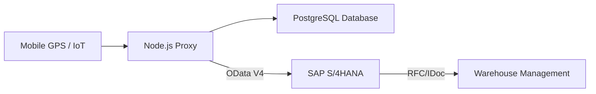

# SAP S/4HANA Integration Guide
## Role: SAP Fiori Trainee Project

This document outlines how this React-based tracking application integrates with SAP S/4HANA environments using OData/Restful services.

### 1. Business Object Mapping
Each asset in this tracker maps to the following SAP standard objects:
- **Truck ID** -> `Equipment Number (EQUI-EQUNR)` or `External Vehicle ID`
- **Delivery ID** -> `Outbound Delivery (LIKP-VBELN)`
- **Current Location** -> `Transportation Management (TM) Execution Data`

### 2. Architecture Diagram (Conceptual)

### 3. Integration Patterns for ABAP Developers
To connect this dashboard to a real SAP backend, an ABAP developer would follow these steps:

#### A. Data Consumption (Pull Pattern)
The SAP system can fetch real-time fleet coordinates using our `/api/devices` endpoint.
- **HTTP Method**: GET
- **Format**: JSON (Mapped to SAP internal structures)
- **ABAP Utility**: `CL_HTTP_CLIENT` or `CL_REST_RESOURCE_CLIENT`

#### B. Data Sync (Push Pattern)
When an Outbound Delivery is created in SAP (T-Code: `VL01N`), a **Business Object Event** can trigger a call to our `/api/sap-sync` endpoint to "Register" the journey.

### 4. Fiori Design Language (FLS)
This application adheres to Fiori 3.0 (Horizon) principles:
- **Analytical KPI Tiles**: Role-based overview of fleet health.
- **List Report Pattern**: Searchable sidebar with priority-based value states.
- **Object Page**: Bottom-sheet detailing the specific status of a Delivery Document.

### 5. Resume Highlights (Copy/Paste)
If you are adding this to your resume, use these bullet points:
- *Implemented a real-time logistics dashboard using React and Node.js, designed to integrate with SAP S/4HANA OData services.*
- *Mapped logistics asset IDs to SAP Standard Delivery Documents (LIKP) to enable end-to-end supply chain visibility.*
- *Applied Fiori Design Principles (Analytical Tiles, Role-based Views) to a custom-built web application.*
